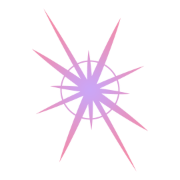
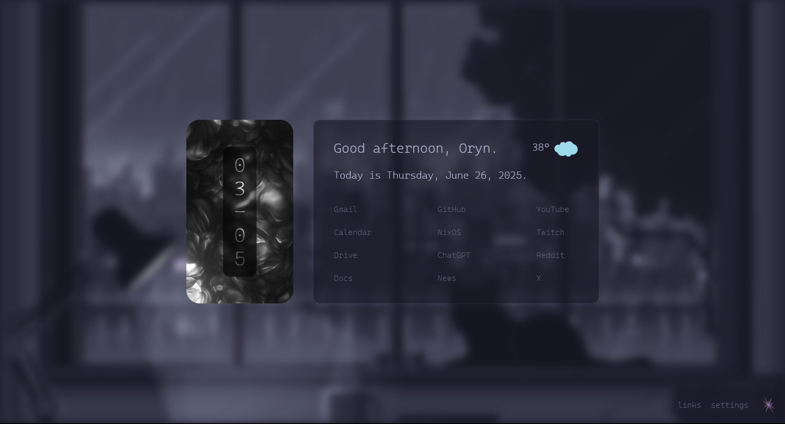
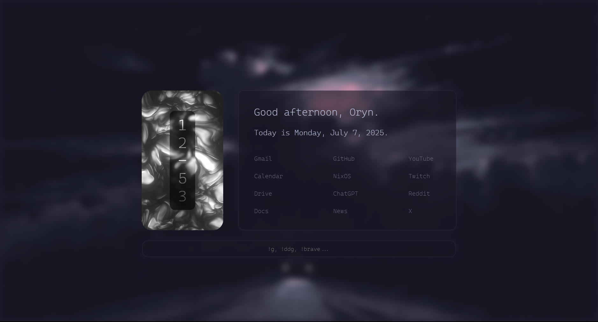
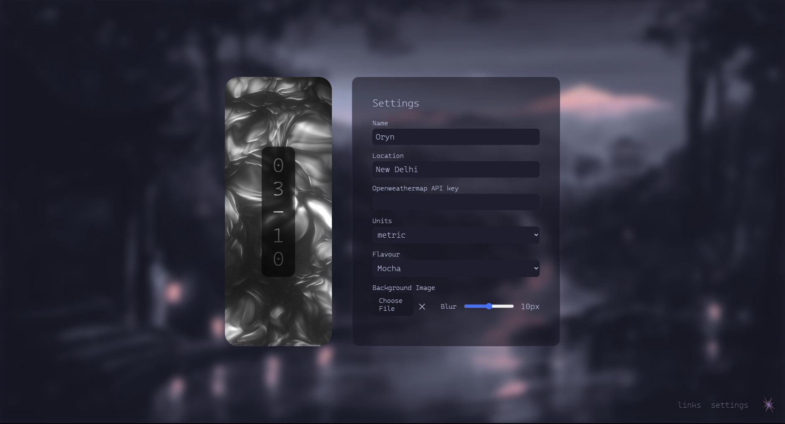
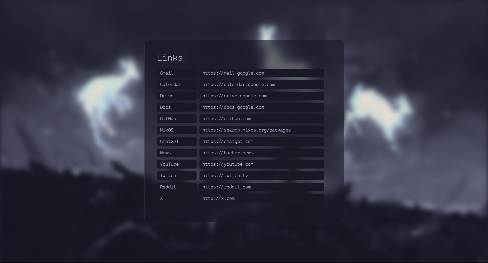

<div align="center">



<h1>
  Startlight
</h1>

<h3>✦ A Luminous Digital Portal ✦</h3>

*"Where every new tab becomes a gateway to serenity,*  
*Crafted with Svelte, kissed by Catppuccin's beauty."*

<div align="center">

[](https://www.mozilla.org/firefox/)
[](https://www.google.com/chrome/)
[](https://brave.com/)

</div>

[](https://svelte.dev/)
[](https://catppuccin.com/)

<a href="https://github.com/OrynVail/Startlight/blob/main/LICENSE">
    
  </a>
  <a href="https://github.com/OrynVail/Startlight/stargazers">
    
  </a>


 
🎨 Catppuccin Flavours ✦ Glassmorphism Aesthetics ✦ Weather Integration ✦ Svelte Performance

</div>

---

## 🌟 Gallery

<div align="center">

 


 

*Experience the sublime beauty of each Catppuccin flavour*

</div>

---

## ✨ Features

<div align="center">

### 🎯 Core Capabilities

| Feature | Description |
|---------|-------------|
| **🔍 Omnibox Search** | Built-in invisible search bar with multi-engine support (!g, !ddg, !brave) |
| **🎨 Catppuccin Themes** | Four exquisite flavours: Latte, Frappé, Macchiato, Mocha |
| **🌌 Dynamic Backgrounds** | Customizable imagery that breathes life into your portal |
| **🧊 Glassmorphism** | Modern frosted glass aesthetics with elegant blur effects |
| **🌤️ Weather Oracle** | Real-time weather integration via OpenWeatherMap API |
| **⏰ Temporal Awareness** | Localized time and date display with elegant typography |
| **🔗 Quick Navigation** | Personalized quick links for instant access to your digital realm |
| **⚙️ Intuitive Settings** | Minimal configuration panel revealed through hover interaction |
| **💨 Svelte Performance** | Lightning-fast rendering with minimal resource footprint |
| **🌐 Compatibility** | Works seamlessly with Brave, Chrome & Firefox |

</div>

---

## 📦 Installation

### Prerequisites

Install the [Cascadia Code](https://github.com/microsoft/cascadia-code) font family on your system for optimal typography.

### Browser Installation

<div align="center">

#### 🦊 Firefox Installation

</div>

##### Download the latest version
Go to [releases](https://github.com/OrynVail/Startlight/releases) and download the .xpi file

1. Navigate to about:addons in Firefox
2. Click the gear icon → "Install Add-on From File..."
3. Select the .xpi file from the repo

<div align="center">

#### 🌐 Chrome / Brave Installation

</div>

```bash
# Clone or download the repository
git clone https://github.com/OrynVail/Startlight.git
cd Startlight

# Navigate to chrome://extensions/ or brave://extensions/
# Enable "Developer Mode"
# Click "Load unpacked" → select the /public/ folder
```

---

## 🛠️ Customization

### ⚙️ Settings Panel

Hover in the **bottom right corner** to reveal the ethereal settings panel:

<div align="center">

| Setting | Description |
|---------|-------------|
| **👤 Personalization** | Set your preferred name for a personal touch |
| **🌤️ Weather Configuration** | Add your OpenWeatherMap API key for weather integration |
| **🖼️ Background Artistry** | Upload or select custom background imagery |
| **🎨 Flavour Selection** | Choose between Latte, Frappé, Macchiato, or Mocha themes |
| **🔗 Quick Links** | Customize your frequently accessed portals |

</div>

### 🎨 Theme Flavours

<div align="center">

| Flavour | Vibe | Best For |
|---------|------|----------|
| **☀️ Latte** | Light & Airy | Daytime productivity |
| **🌅 Frappé** | Warm Twilight | Evening sessions |
| **🌙 Macchiato** | Cool Midnight | Night owls |
| **🌑 Mocha** | Deep Darkness | True dark mode lovers |

</div>

---

## 🔧 Development

### Local Development

```bash
# Clone the repository
git clone https://github.com/oryn-ai/startlight.git
cd startlight

# Install dependencies
npm install

# Start development server
npm run dev

# Build for production
npm run build
```

---

## 🤝 Contributing

Contributions to enhance this digital portal are warmly welcomed!

### Ways to Contribute

- 🐛 Report bugs or visual inconsistencies
- 💡 Suggest new features or integrations
- 🎨 Propose new Catppuccin theme implementations
- 📝 Improve documentation

---

## 🙏 Acknowledgments

- [refact0r](https://github.com/refact0r) - For the foundational code and design
- [Catppuccin](https://catppuccin.com/) - For the sublime color palettes that inspire tranquility
- [Svelte](https://svelte.dev/) - For the elegant framework that makes magic possible
- [OpenWeatherMap](https://openweathermap.org/) - For bringing weather awareness to your portal

---

## 📜 License

This project is licensed under the MIT License - see the [LICENSE](LICENSE) file for details.

---

<div align="center">

### 🌟 Support Startlight

If this portal brightens your browsing experience:

[](https://github.com/OrynVail/Startlight/stargazers)

---

*"In the gentle glow of Startlight, every journey begins with beauty."*

</div>

